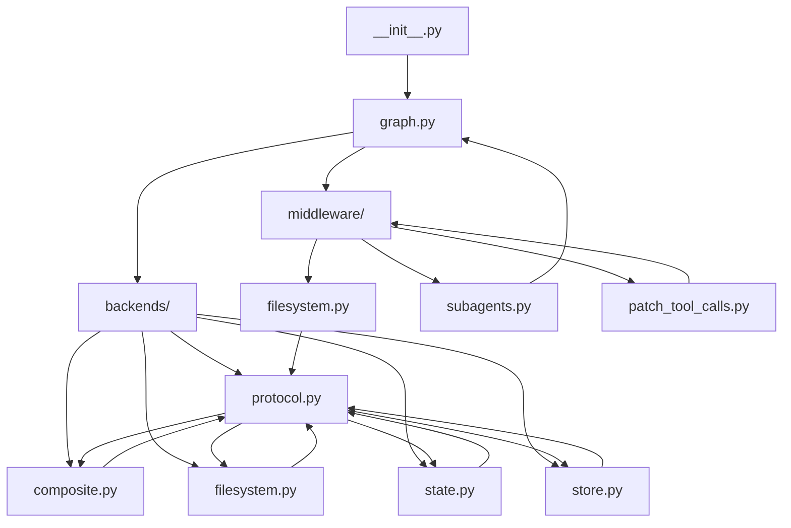

我将为您分析 deepagents 包的主要文件调用关系和作用。让我先查看该包的结构和关键文件。

现在我已经了解了 deepagents 包的主要文件结构和功能，让我为您总结一下：

## deepagents 包主要文件及其调用关系

### 1. 核心入口 - [\_\_init\_\_.py](/libs\deepagents\deepagents\__init__.py)
这是 deepagents 包的入口文件，导出了核心功能：
- [create_deep_agent](/libs\deepagents\deepagents\graph.py#L39-L160)：创建深度代理的主要函数
- [FilesystemMiddleware](/libs\deepagents\deepagents\middleware\filesystem.py#L781-L1084)：文件系统中间件
- [SubAgent](/libs\deepagents\deepagents\middleware\subagents.py#L16-L44) 和 [SubAgentMiddleware](/libs\deepagents\deepagents\middleware\subagents.py#L376-L483)：子代理相关类
- [CompiledSubAgent](/libs\deepagents\deepagents\middleware\subagents.py#L47-L57)：预编译子代理类

### 2. 主要创建函数 - [graph.py](/libs\deepagents\deepagents\graph.py)
这个文件包含了创建深度代理的核心逻辑 [create_deep_agent](/libs\deepagents\deepagents\graph.py#L39-L160) 函数：
- 集成了待办事项列表、文件系统和子代理功能
- 默认提供了文件操作工具(ls, read_file, write_file, edit_file, glob, grep, execute)
- 支持子代理功能，允许创建专门用途的子代理
- 内置了摘要和缓存中间件以优化性能

### 3. 后端系统 - `backends/` 目录
实现各种存储和执行后端：

#### [protocol.py](/libs\deepagents\deepagents\backends\protocol.py)
定义了后端接口协议：
- [BackendProtocol](/libs\deepagents\deepagents\backends\protocol.py#L159-L357)：基本文件操作接口（ls_info, read, write, edit等）
- [SandboxBackendProtocol](/libs\deepagents\deepagents\backends\protocol.py#L378-L404)：扩展接口，增加了执行命令的能力
- 定义了标准的文件操作错误类型和响应格式

#### [composite.py](/libs\deepagents\deepagents\backends\composite.py)
复合后端实现，可以根据路径前缀路由到不同后端：
- 支持将不同路径映射到不同后端
- 统一接口，对外提供一致的操作方式
- 支持默认后端和多个路由后端

#### [filesystem.py](/libs\deepagents\deepagents\backends\filesystem.py)
文件系统后端实现：
- 直接读写文件系统中的文件
- 支持安全路径解析，防止路径遍历攻击
- 实现了完整的文件操作功能（ls, read, write, edit, grep等）

#### [state.py](/libs\deepagents\deepagents\backends\state.py) 和 [store.py](/libs\deepagents\deepagents\backends\store.py)
- [StateBackend](/libs\deepagents\deepagents\backends\state.py#L19-L184)：将文件存储在 LangGraph 状态中
- [StoreBackend](/libs\deepagents\deepagents\backends\store.py#L27-L439)：将文件存储在持久化存储中

### 4. 中间件系统 - `middleware/` 目录

#### [filesystem.py](/libs\deepagents\deepagents\middleware\filesystem.py)
文件系统中间件：
- 为代理提供文件系统工具（ls, read_file, write_file, edit_file, glob, grep）
- 如果后端支持执行，还会提供 execute 工具
- 实现了工具结果过大时自动保存到文件系统的功能

#### [subagents.py](/libs\deepagents\deepagents\middleware\subagents.py)
子代理中间件：
- 提供 `task` 工具，允许创建临时子代理处理复杂任务
- 支持多种类型的子代理，每种都有专门的功能和提示
- 实现了子代理的生命周期管理

#### [patch_tool_calls.py](/libs\deepagents\deepagents\middleware\patch_tool_calls.py)
工具调用修复中间件：
- 修复模型可能产生的无效工具调用
- 提高工具调用的稳定性

## 调用关系图

## 总结

deepagents 包提供了一套完整的智能代理框架，其特点包括：

1. **模块化设计**：通过后端系统和中间件系统实现了高度模块化，便于扩展和定制
2. **灵活的存储方案**：支持内存存储、文件系统存储和持久化存储等多种后端
3. **强大的文件操作能力**：内置丰富的文件系统工具，支持复杂的文件操作
4. **子代理系统**：支持创建专门用途的子代理处理复杂任务
5. **安全性考虑**：实现了路径验证和防路径遍历攻击等安全措施
6. **性能优化**：集成了摘要和缓存机制，提高大型上下文处理效率

整体而言，deepagents 包是一个功能强大且灵活的智能代理开发框架，适用于各种复杂的自动化任务场景。