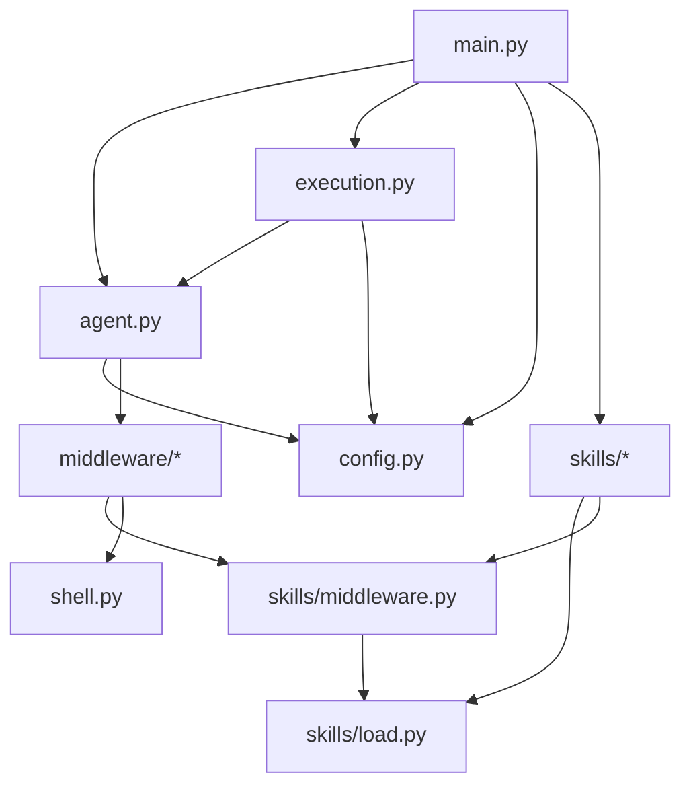

我将分析 deepagents-cli 包内主要文件的调用关系和作用。首先让我查看该包的结构和关键文件。

基于对 deepagents-cli 包中主要文件的分析，我来为您总结各文件的作用和调用关系：

## 主要模块及功能

### 1. 入口点和主循环 - [main.py](/libs\deepagents-cli\deepagents_cli\main.py)
这是整个 CLI 应用的核心入口文件：
- 处理命令行参数解析
- 初始化应用环境和依赖检查
- 设置和管理沙盒环境（如 Modal、Runloop、Daytona）
- 启动主交互循环
- 协调各个组件的集成

### 2. agent管理 - [agent.py](/libs\deepagents-cli\deepagents_cli\agent.py)
负责创建和管理 AI agent：
- 创建具有特定配置的agent实例
- 管理agent的系统提示（system prompt）
- 设置工具中断机制（human-in-the-loop）
- 管理agent的记忆和技能中间件
- 处理本地模式与远程沙盒模式的不同配置

### 3. 任务执行 - [execution.py](/libs\deepagents-cli\deepagents_cli\execution.py)
负责实际的任务执行和交互处理：
- 执行用户提交的任务
- 处理流式响应输出
- 管理工具调用的审批流程
- 显示工具调用和结果
- 处理文件操作跟踪

### 4. 技能系统 - `skills/` 目录
实现 Agent 技能系统，采用 Anthropic 的渐进式披露模式：
- [load.py](/libs\deepagents-cli\deepagents_cli\skills\load.py): 解析和加载技能元数据
- [middleware.py](/libs\deepagents-cli\deepagents_cli\skills\middleware.py): 将技能信息注入系统提示，使agent能够发现和使用技能
- [commands.py](/libs\deepagents-cli\deepagents_cli\commands.py): 处理技能相关的命令行指令

### 5. 配置管理 - [config.py](/libs\deepagents-cli\deepagents_cli\config.py)
管理全局配置和设置：
- 环境变量检测和加载
- API 密钥管理
- 项目根目录检测
- 用户和项目级别的路径管理
- 默认提示词和基础设置

### 6. 其他辅助模块
- [tools.py](/libs\deepagents-cli\deepagents_cli\tools.py): 提供网络相关工具（网页搜索、HTTP 请求等）
- [file_ops.py](/libs\deepagents-cli\deepagents_cli\file_ops.py): 处理文件操作相关的功能
- [ui.py](/libs\deepagents-cli\deepagents_cli\ui.py): 用户界面相关功能
- [shell.py](/libs\deepagents-cli\deepagents_cli\shell.py): Shell 命令执行中间件

## 关键调用关系图

## 工作流程

1. **启动阶段**：
   - [main.py](/libs\deepagents-cli\deepagents_cli\main.py) 解析命令行参数并初始化环境
   - 加载配置文件和环境变量
   - 创建agent实例（通过 [agent.py](/libs\deepagents-cli\deepagents_cli\agent.py)）

2. **agent配置阶段**：
   - [agent.py](/libs\deepagents-cli\deepagents_cli\agent.py) 根据是否使用沙盒环境配置不同的后端
   - 加载技能系统并注入到agent提示中
   - 设置中间件链（记忆、技能、Shell等）

3. **交互循环**：
   - [main.py](/libs\deepagents-cli\deepagents_cli\main.py) 进入交互循环等待用户输入
   - 用户输入传递给 [execution.py](/libs\deepagents-cli\deepagents_cli\execution.py) 执行
   - [execution.py](/libs\deepagents-cli\deepagents_cli\execution.py) 处理与agent的交互，包括工具调用审批

4. **技能系统**：
   - `skills/load.py` 在会话开始时扫描可用技能
   - `skills/middleware.py` 将技能信息注入系统提示
   - agent根据需要读取具体技能的详细说明

这种架构设计使得 deepagents-cli 成为一个功能完整的 AI 编程助手，具备本地和远程执行能力、技能扩展系统以及人机协作的安全机制。

## 中间件
  - 最终的中间件顺序
    - `PromptLoggerNodeMiddleware`
    - `TodoListMiddleware`
    - `FilesystemMiddleware`
    - `SubAgentMiddleware`
    - `SummarizationMiddleware`
    - `AnthropicPromptCachingMiddleware`
    - `PatchToolCallsMiddleware`
    - `AgentMemoryMiddleware`
    - `SkillsMiddleware`
    - `ShellMiddleware`
    - `PromptLoggerWrapperMiddleware`
    - `HumanInTheLoopMiddleware`